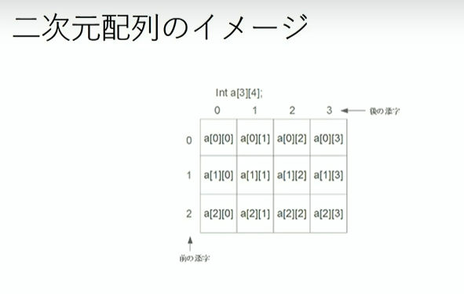
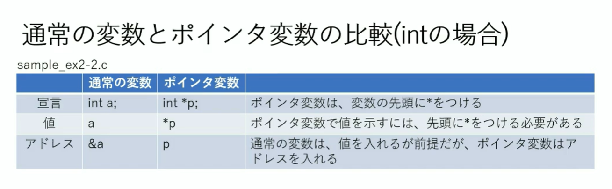

## 主要なエスケープシーケンス
\a 警告音
\b バックスペース
\n 改行
\t tab
\0 null

## 主要な書式指定
%d 整数値を10真数で表示
%f 実数値を10真数で表示
%lf 実数値を10真数で表示→%fより長い桁の場合
%c 文字
%s 文字列

## 文字列について
文字列型はないので、文字型の配列を使う
最後に\0のnull文字を入れる
// char s1[4] = {'a', 'b', 'c', '\0'};



## 関数のプロトタイプ宣言
main関数より前で関数は宣言する必要があるが、mainがどんどん下に下がるのを防ぐために、
プロトタイプ宣言を使う
型名 関数名(引数の型, ...);
`double avg(double, double);`

## ファイル分割
- ヘッダファイル
マクロの定義
ヘッダファイルのincludeを定義側コードと利用側コードでincludeしているため、2重でエラーとならないようにする。cはcファイルごとにコンパイルするため、ヘッダファイルが必要。　
- ソースファイル
プログラムや関数の定義

```c
#include <stdio.h>
#include "calc.c" // 独自関数は"で囲む
```

mainファイルでプロトタイプ宣言をしている場合、mainファイルと関数定義ファイルで2回ヘッダーファイルを読み込むことになる。2回低地するとエラーになるので、インクルードガードを使う
```c
// #ifndefなどはマクロといい、コンパイラ向けの指示
#ifndef _CALC_H_ // _CALC_H_が定義されていなければ
#define _CALC_H_ // CALC_H_を定義する

// ヘッダファイルの中でプロトタイプ宣言をする
double avg (double, double);

#endif // 同一コンパイルないで再度includeされた場合、定義済みなのでスキップする(_CALC_H_が定義されていれば2回目以降は何もしない)
```

## 複数ヘッダファイル・ソースファイルへの分割
- グローバル変数の扱い
あるソースファイルでグローバル変数を宣言しても、他ソースファイルでは使えない
→使われる側のソースファイルで`extern` を使う
externとは外にという意味なので、外のソースファイルに定義されていると指示できる

## ポインタ変数
アドレスを入れることを前提とした数、アドレス先のものになりすますイメージ
先頭に*をつけるとポインタ変数になる
ポインタ変数にはアドレスi`%&`を入力する

ポインタのメリットは関数は一つしか値を返せないが、複数のポインタ変数を引数として渡せば、複数の戻り値を持つようにできる

*int num -> int型のポインタ変数num
変数の頭に*をつけると、ポインタの指す値を示す
*num -> ポインタ変数numの指す先の値

int *num -> int型のポインタ変数num
int* a,bとやると、aのみポインタ変数になってしまうので注意

```
- ポインタ変数は*で宣言する
- ポインタ変数はアドレスを入力するので、ポインタのさす値は*をつけて取得する
- ポインタ変数はアドレスを入力するので、アドレスじたいはポインタ変数で取得する
- (重要！！！)ポインタ変数を作る*は、`型名* ポインタ変数名`or`型名 *ポインタ変数名`、ポインタの指す値の取得は、`*ポインタ名`
**
```


**宣言時はアドレスかNULLで指定しないとバグになる**
```c
int *p = NULL;
*p = 2; // アドレス指定なしで値代入はバグになるので注意
```

## ポインタ変数で配列を使う場合のメリット　
cでは配列を関数に渡すと、先頭要素へのポインタが渡される
→多くの要素をもつ配列でも、アドレス１子分のみ渡せば渡すことができる
→ポインタ変数だけ渡せば、あとはポインタ変数をインクリメントしていけば配列の値もインクリメントされていく
```c
double d[3] = {0.2, 0.4, 0.6};
double *p1 = NULL;

p1 = d; // ポインタ変数p1に配列dを渡すと、先頭アドレスを渡すため、p1の指す値でなくポインタ変数(*なし)に入れることができる
```

## 動的なメモリの作成
malloc()を使えば動的にメモリを確保できる
→void*をreturnするため、必要なポインタ型にキャストする必要がある
メモリを使ったあとはfree(p1)でヒープ領域を解放する必要あり
必要なときのみ確保し、いらないときにメモリ解放できるのがメリット
```c
int *p = (int*)malloc(sizeof(int) * 3); 
```

## メモリ領域
1. プログラム領域 コンパイルしたマシン後を格納
2. 静的領域 グローバル変数やstatic変数を格納
3. ヒープ領域 動的に確保されたメモリを格納
4. スタック領域 ローカル変数などを格納

## 構造体
複数の型の変数を入れるイメージ
```c
strauct student {
  int id;
  char name[256];
  int age;
}
```

typedef既存の構造体の型で新しい構造体を宣言する
```c
typedef struct student student_data;
// student_dataという構造体の型で宣言
studen_data s;
```

構造体のメンバへのアクセスは.を使うが、 ポインタの場合はアロー演算子`->`を使う

ポインタ渡し出なくデータ渡しを使う場合はデータ自体をコピーしてしまうためスタック領域を圧迫してしまう
→基本的にはポインタ渡しを使うべき　